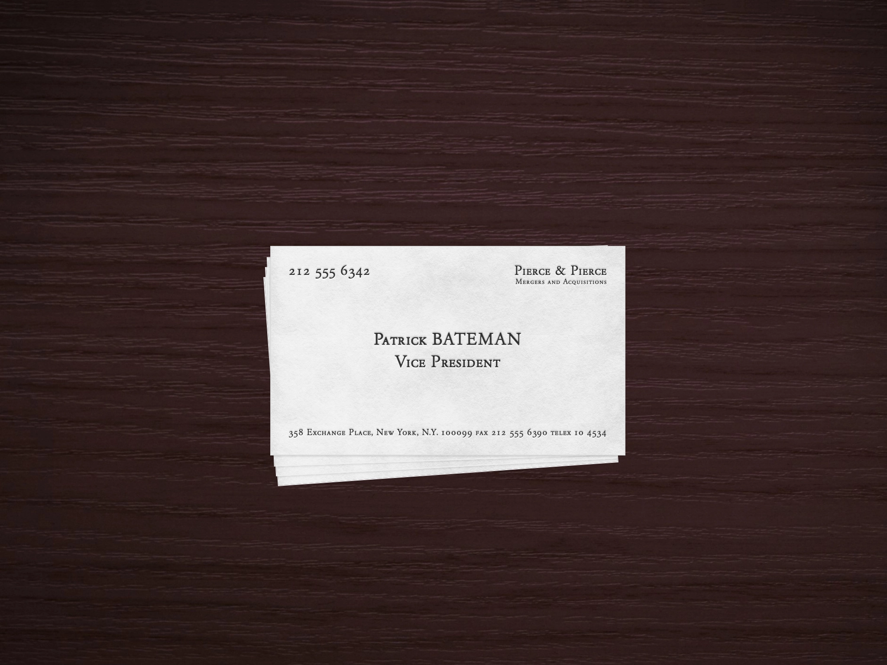

# Patrick Bateman Website Template

Patrick Bateman's business card, in the form of a website template.

- Bone coloring.
- The lettering is something called "Silian Rail" (Garamond Classico SC).
- Mobile-responsive.
- Built with plain HTML and CSS.
- The cards underneath move on hover... and you can remove them.
- Free to use, and you can remove the credit on the page. But please leave the credit in the code!
- The code can always be improved. Request a PR if you make any changes to the original template.
- If you find it useful, you can [sponsor me on GitHub](https://github.com/sponsors/taylorsudo?frequency=one-time).

Let's see [Paul Allen's card](https://taylorsudo.github.io/patrick-bateman/paul-allen).